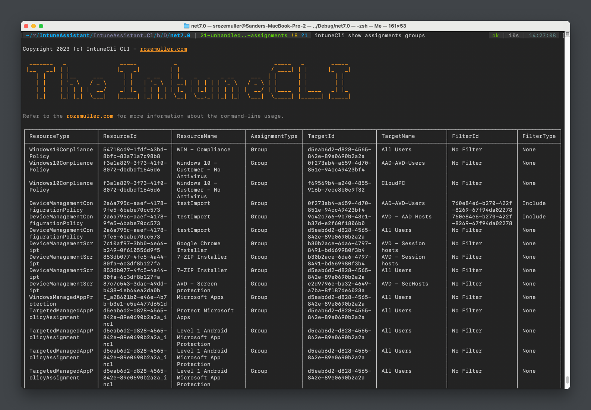

### General module information
<a href="https://github.com/srozemuller/intuneassistant" target="_blank"></a> <a href="https://github.com/srozemuller/intuneassistant/issues" target="_blank"></a> </a><a href="https://github.com/srozemuller/intuneassistant/tree/beta" target="_blank"></a> </a><a href="https://github.com/srozemuller/intuneassistant/tree/beta" target="_blank"></a>


<a href="https://www.buymeacoffee.com/srozemuller" target="_blank"></a>


# IntuneAssistant

Welcome to **The IntuneCLI**. This CLI helps you managing Microsoft Intune environments.


## Installation
To use this tool several options are available and can be use on Windows, MacOS and Linux.
In any way you first need to install at least `dotnet 7.0`. To install dotnet use the commands below.

### Install dotnet 7 sdk Windows
winget install --id Microsoft.DotNet.SDK.7 --source winget --log C:\Temp\install.log
Check the link on [Microsoft Learn](https://learn.microsoft.com/en-us/dotnet/core/install/windows?tabs=net70) for installing dotnet 7.0 on Windows.
### Install dotnet 7 sdk macOS
Check the link on [Mircosoft Learn](https://learn.microsoft.com/en-us/dotnet/core/install/macos)

### NuGet
The recommended way to install this tool is with the use of the NuGet repository. Using the NuGet repository simplifies the download process. 
By using the install command below the correct package is selected automatically.  
Another advantage is using the NuGet installation method is that the command ```intuneCli``` becomes available in your whole system. 
You don't have to execute the specific file.

### Add the nuget feed
```
dotnet nuget add source https://api.nuget.org/v3/index.json --name nuget.org
```

### This command will install the tool
```
dotnet tool install --global IntuneCLI
```

### Update to the latest version
```
dotnet tool update --global IntuneCLI
```

### Clear nuget cache (if the tool is not found)
It can happen that the update process does not find the latest package available on NuGet. In that case, you have to clear the local NuGet cache.
```
dotnet nuget locals all --clear
```

### Installation alternatives
When not using NuGet, there are release packages available at the releases page: https://github.com/srozemuller/IntuneAssistant/releases
After downloading the correct OS package, you have to execute the file and provide the commands. 
In the examples below I show the `NuGet` way. In the case you use the binaries, then go the the folder where the binary is in and then use .\intuneCLI [command]


### Authentication
To authentication use this command. The command opens a browser for interactive login.
```shell
intuneCli auth login
```


To log out use:
```shell
intuneCli auth logout
```

### Intune Assignments overview
To view all assignments in Intune use this command:
```shell
intuneCli show assignments
```

### Intune Group Assignments overview
To view all assignments in Intune use this command:
```shell
intuneCli show assignments groups
```

To view a specific group based on group name, overview use this command:
```shell
intuneCli show assignments groups --group-name "All Users"
```
To view a specific group based on group id, overview use this command:
```shell
intuneCli show assignments groups --group-id 000-0000
```

To export the overview to CSV use:
```shell
intuneCli show assignments groups --group-id 000-0000 --export-csv filename.csv
```



### Help
If you need more information about all commands available use the `-h` option in a specific area.

```shell
intuneCli auth -h
```

```shell
intuneCli show devices -h
```

